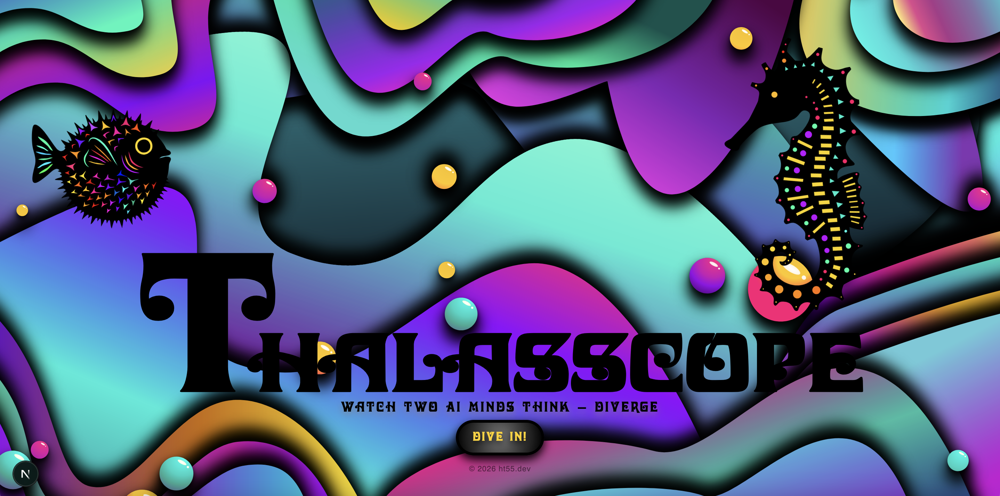
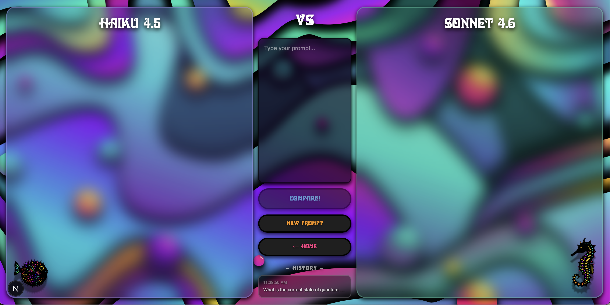

# Thalasscope

### Watch two AI minds think — diverge.

<p align="center">
  
  
</p>

**🤖 Live Demo → [Thalasscope](https://thalasscope.ht55.dev)**

---

## Why I built this

Most AI tools show you the answer. They hide the thinking.

Some models deliberately conceal their reasoning process from users — you get the conclusion, but not how they got there, which sources they trusted, or where they hesitated. That always bothered me.

I wanted to see the thinking. Not just the result — the full reasoning chain: which sources each model pulled, why it chose some and skipped others, where it second-guessed itself, and how it arrived at its final response. And I wanted to see two different models do this *simultaneously*, so the divergence becomes visible.

That's Thalasscope, a glass box for AI reasoning.

And once you can see the thinking, you can do more with it — save the session data, go back and fact-check which sources each model actually used, compare how reasoning depth varied across different types of prompts, or just dig into the data out of pure curiosity (another fun part!). The thinking process shouldn't disappear the moment the response arrives.

---

## What it does

- Sends the same prompt to **Claude Haiku 4.5** and **Claude Sonnet 4.6** simultaneously
- Streams each model's **extended thinking process** in real time, side by side
- Shows which **web sources** each model found, chose, or skipped — and why
- Breaks thinking into **labeled blocks** that surface as each model reasons through the problem
- Lets you compare **reasoning depth**, **source selection strategy**, and **final responses**
- Sessions saved to **your own Supabase** (optional, BYOS) or reviewed in the in-session history panel
- Full **BYOK** — your Anthropic API key never touches a third-party server

---

## How to use

1. Click **Dive In!** and enter your Anthropic API key
2. Optionally connect your own Supabase to save sessions
3. Type any prompt and hit **Compare!** — watch both models think in real time
4. Click any past session in the **history panel** to replay it

---

## Stack

Next.js 15 (App Router) · TypeScript · Anthropic API · Supabase · Tailwind CSS

---

## Setup

### 1. Clone and install

```bash
git clone https://github.com/yourname/thalasscope.git
cd thalasscope/thinking-visualizer
npm install
```

### 2. Install and run

```bash
npm install
npm run dev
```

No environment variables needed. All credentials are entered in the UI by the user.

> The Anthropic API key is never stored server-side. Users enter their own key in the UI (BYOK). It lives in `sessionStorage` only and is cleared when the tab closes.

### 3. Supabase tables　(optional — for BYOS users only)

Run this in your Supabase SQL Editor:

```sql
CREATE TABLE sessions (
  id                uuid DEFAULT gen_random_uuid() PRIMARY KEY,
  created_at        timestamp WITH TIME ZONE DEFAULT now(),
  prompt            text NOT NULL,
  prompt_category   text CHECK (prompt_category IN (
                      'logical', 'creative', 'code',
                      'analysis', 'factual', 'planning', 'other'
                    )),
  prompt_complexity text CHECK (prompt_complexity IN (
                      'simple', 'moderate', 'complex'
                    )),
  prompt_summary    text,
  notes             text
);

CREATE TABLE responses (
  id                   uuid DEFAULT gen_random_uuid() PRIMARY KEY,
  session_id           uuid REFERENCES sessions(id) ON DELETE CASCADE,
  created_at           timestamp WITH TIME ZONE DEFAULT now(),
  model                text NOT NULL CHECK (model IN (
                         'claude-haiku-4-5',
                         'claude-sonnet-4-6'
                       )),
  thinking_text        text,
  thinking_word_count  integer,
  thinking_duration_ms integer,
  response_text        text,
  response_word_count  integer,
  total_duration_ms    integer,
  input_tokens         integer,
  output_tokens        integer
);

CREATE INDEX idx_responses_session_id ON responses(session_id);
CREATE INDEX idx_sessions_created_at ON sessions(created_at DESC);
CREATE INDEX idx_sessions_category ON sessions(prompt_category);
```

---

## Models

| Model | Thinking style | Characteristic |
|---|---|---|
| **Claude Haiku 4.5** | Focused, efficient | Fast. Sharp on direct reasoning. Often finishes first. |
| **Claude Sonnet 4.6** | Deep, multi-layered | Slower. More exploratory. Longer reasoning chains. |

Both models support **Extended Thinking**, making their full reasoning process accessible via the API. The contrast between the two is the point — same question, different minds.

---

## BYOK & BYOS

**BYOK (Bring Your Own Key)**
Your Anthropic API key is entered in the browser, stored only in `sessionStorage`, and forwarded directly to the Anthropic API via your own Next.js server. It is never logged or persisted anywhere.

**BYOS (Bring Your Own Supabase)**
Session data goes to *your* Supabase project, not a shared database. Each user's reasoning data stays in their own account — because prompts are personal.

---

## Cost & Tuning

Thinking tokens are billed at the same rate as output tokens. The deeper the model thinks, the more it costs — and the more you see. This means cost itself becomes a signal of reasoning depth.

### Pricing per model (approximate, based on typical usage)

| | Haiku 4.5 | Sonnet 4.6 |
|---|---|---|
| Input | $0.80 / 1M tokens | $3.00 / 1M tokens |
| Output + Thinking | $4.00 / 1M tokens | $15.00 / 1M tokens |
| **Typical cost per comparison** | **~$0.05** | **~$0.19** |

### Thinking budget

The thinking budget controls how deeply each model reasons. Set in `src/app/api/think/route.ts`:

```typescript
const BUDGET_TOKENS = 3000  // default — good balance of depth and cost
```

Increase to `10000` for richer, more exploratory thinking blocks. Decrease for faster, cheaper runs.

### Prompt caching

The system prompt is cached using `cache_control: { type: 'ephemeral' }`. Repeated calls within a 5-minute window reuse the cached prompt, reducing input token costs by approximately **70%** — useful for demo sessions or repeated testing.

---

## How thinking is visualized

Each model's output is broken into three block types:

| Block | Color | What it shows |
|---|---|---|
| `searching the web` | Blue | Sources found, chosen, or skipped — with reasons |
| `thinking` | Purple (Haiku) / Amber (Sonnet) | Labeled reasoning chunks as they stream in |
| `response` | Emerald | The final answer |

The system prompt instructs each model to label its own thinking chunks naturally — not with fixed categories, but in its own words. This preserves each model's reasoning personality while making the structure scannable.

---

## Project structure

```
thinking-visualizer/
├── public/
│   ├── fonts/               # Sylvar font
│   └── images/              # Ocean background, seahorse, pufferfish SVGs
├── src/
│   ├── app/
│   │   ├── api/
│   │   │   ├── think/route.ts       # Parallel streaming — both models simultaneously
│   │   │   └── sessions/route.ts    # BYOS Supabase save & retrieve
│   │   ├── run/page.tsx             # Main comparison page
│   │   └── page.tsx                 # Landing page
│   ├── components/
│   │   ├── OceanBackground.tsx      # Animated SVG background (inline)
│   │   ├── SeahorseSVG.tsx          # Seahorse character
│   │   └── PuffyfishSVG.tsx         # Pufferfish character
│   └── lib/
│       └── mockData.ts              # Mock responses for UI development
└── .env.local                       # Environment variables (never committed)
```

---

## Future plans (V2)

- Support for additional models: Gemini, GPT, Grok
- Each model pairing gets its own visual theme (ocean for Claude vs Claude, battle for Claude vs Gemini...)
- Session analysis dashboard for BYOS users
- Mobile layout

---

## Notes

- Original SVG artwork and animated background created in Corel
- Font: Sylvar
- Personal / portfolio project

---

## License

This project is licensed under the [PolyForm Noncommercial License 1.0.0](https://polyformproject.org/licenses/noncommercial/1.0.0/).

Free to use and share for noncommercial purposes.  
For commercial use inquiries, please reach out at [contact@ht55.dev](mailto:contact@ht55.dev).

© 2026 [Hiroko Takano / ht55.dev]
